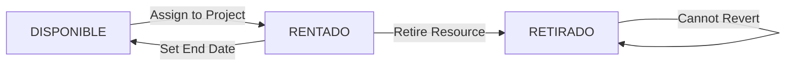

# Resource Allocation Guide

Learn how to allocate equipment and services to projects, configure maintenance schedules, and manage resource lifecycles.

## Overview

Resources in Mantis represent physical equipment or services that are deployed to client projects. Each resource has:
- **Status tracking** (DISPONIBLE → RENTADO → DISPONIBLE)
- **Cost management** (rental and maintenance costs)
- **Maintenance scheduling** (based on frequency types)
- **Commitment dates** (operation start and end dates)

<Info>
Mantis supports two resource types: **EQUIPO** (physical equipment like tanks, pumps) and **SERVICIO** (services like maintenance contracts).
</Info>

---

## Adding Resources to a Project

<Steps>
  <Step title="Open the Project">
    Navigate to the project detail view and select the **Recursos Asignados** (Assigned Resources) tab.
  </Step>

  <Step title="Click 'Asignar Recursos'">
    Click the **Asignar Recursos** button in the top-right corner. This opens the resource allocation form at `/projects/<id>/resource-form`.
  </Step>

  <Step title="Search and Select Resources">
    Use the autocomplete search field to find available resources:
    
    **Search by:**
    - Resource code (e.g., "TQ-001")
    - Equipment type (e.g., "Tanque", "Bomba")
    - Description

    The autocomplete only shows resources with status **DISPONIBLE** (available).

    <Note>
    Physical equipment can only be assigned to one project at a time. Services can be assigned to multiple projects.
    </Note>
  </Step>

  <Step title="Configure Each Resource">
    For each selected resource, configure the following in the table:

    ### Required Fields

    **Fecha Inicio (Start Date)** *
    - The date when this resource begins operation on the project
    - Must be on or after the project start date
    - This date triggers the status change from DISPONIBLE → RENTADO

    ### Cost Configuration

    **Costo Alq (Rental Cost)**
    - Daily rental rate for equipment (not applicable for services)
    - Used for project cost calculations
    - Defaults to 0.00

    **Frec. Alquiler (Rental Frequency)**
    - Always "Diario" (Daily) for equipment
    - N/A for services

    ### Maintenance Configuration

    **Mant (Maintenance Checkbox)**
    - Enable to schedule preventive maintenance
    - Automatically checked for SERVICIO resources
    - Optional for EQUIPO resources

    **Frec. Mant (Maintenance Frequency)**
    - Choose frequency type:
      - **Por intervalo de días**: Every N days (e.g., every 3 days)
      - **Días de la semana**: Specific weekdays (Mon, Tue, etc.)
      - **Días del mes**: Specific dates of the month (1-31)

    **Costo Mnt (Maintenance Cost)**
    - Cost per maintenance event
    - Used for total project cost projections

    ### Service-Specific Fields

    **Equipo Físico (Physical Equipment)** - For services only
    - Optionally link the service to a specific physical equipment
    - Used when a service (like pump maintenance) is tied to a particular equipment unit
    - Select from dropdown of unavailable equipment already on the project
  </Step>

  <Step title="Add Multiple Resources">
    Repeat the search and configuration process for each resource. You can add multiple resources before saving.

    To remove a resource from the list before saving, click the **trash icon** in the Actions column.
  </Step>

  <Step title="Save Resource Assignments">
    Click **Guardar Recursos (X)** where X is the count of resources to be added.

    The system will:
    - Create ProjectResource records
    - Change equipment status from DISPONIBLE → RENTADO
    - Generate maintenance schedule entries in the calendar
    - Calculate project costs
  </Step>
</Steps>

---

## Resource Status Lifecycle

### Status Flow Diagram



### Status Descriptions

<AccordionGroup>
  <Accordion title="DISPONIBLE (Available)">
    **Characteristics:**
    - Resource is in inventory and ready for deployment
    - Appears in autocomplete search when adding resources
    - No active project assignment
    - Can be assigned to a new project

    **When it changes:**
    - Automatically changes to RENTADO when assigned to a project with a start date
  </Accordion>

  <Accordion title="RENTADO (Rented)">
    **Characteristics:**
    - Resource is currently deployed on an active project
    - Has an operation_start_date set
    - No operation_end_date (or end date is in the future)
    - Appears with "ACTIVO" badge in resource table

    **When it changes:**
    - Changes back to DISPONIBLE when an operation_end_date is set (past or present)
    - Changes to RETIRADO if resource is permanently removed from service
  </Accordion>

  <Accordion title="RETIRADO (Retired)">
    **Characteristics:**
    - Resource is permanently out of service
    - Appears with "RETIRADO" badge in red
    - Cannot be edited or deleted
    - Cannot be assigned to new projects
    - Remains in historical records for reporting

    **When it's set:**
    - Manually set by admin when equipment is damaged, sold, or decommissioned
    - This is a terminal state - cannot be reversed
  </Accordion>
</AccordionGroup>

---

## Managing Existing Resources

### Editing Resource Configuration

<Steps>
  <Step title="Open Edit Modal">
    From the **Recursos Asignados** tab, click the **EDITAR** button next to the resource you want to modify.
  </Step>

  <Step title="Modify Settings">
    You can update:
    - Detailed description
    - Rental cost
    - Maintenance configuration (frequency, cost)
    - Operation end date

    <Warning>
    You cannot change the resource type or the assigned equipment once saved. To change these, you must delete and re-add the resource.
    </Warning>
  </Step>

  <Step title="Save Changes">
    Click **Save** to update the resource configuration. Changes take effect immediately.
  </Step>
</Steps>

### Releasing Resources (Setting End Date)

When equipment is returned from a project:

<Steps>
  <Step title="Edit the Resource">
    Click **EDITAR** on the resource in the Recursos Asignados tab.
  </Step>

  <Step title="Set Operation End Date">
    Enter the date when the resource was returned or service ended in the **Fecha Fin** field.
  </Step>

  <Step title="Save">
    Click **Save**. The system will:
    - Change resource status from RENTADO → DISPONIBLE
    - Make the resource available for assignment to other projects
    - Stop generating future maintenance events
    - Calculate final costs for the rental period
  </Step>
</Steps>

<Tip>
Set end dates as soon as equipment is returned to keep inventory status accurate in real-time.
</Tip>

### Removing Resources

To delete a resource assignment from a project:

<Steps>
  <Step title="Click 'ELIMINAR'">
    In the Actions column of the resource table, click the **ELIMINAR** button.
  </Step>

  <Step title="Confirm Deletion">
    Click **ELIMINAR** again (the button will show "CONFIRMAR") to confirm.

    <Warning>
    You can only delete resources that are:
    - Not in a work sheet (no "EN USO" badge)
    - Not retired (no "RETIRADO" badge)
    </Warning>
  </Step>

  <Step title="Resource Removed">
    The system will:
    - Delete the ProjectResource record
    - Change equipment status back to DISPONIBLE
    - Remove associated maintenance events
  </Step>
</Steps>

---

## Maintenance Frequency Configuration

### Frequency Type: DAY (Interval Days)

Schedule maintenance every N days.

**Example Configuration:**
- **Frequency Type**: Por intervalo de días
- **Interval Days**: 3
- **Result**: Maintenance scheduled every 3 days starting from operation_start_date

**Use Cases:**
- Oil changes (every 7 days)
- Filter cleaning (every 3 days)
- Regular inspections (every 30 days)

```
Start Date: March 1
Schedule: March 1, March 4, March 7, March 10, March 13...
```

### Frequency Type: WEEK (Weekdays)

Schedule maintenance on specific days of the week.

**Example Configuration:**
- **Frequency Type**: Días de la semana
- **Weekdays**: Mon, Wed, Fri (select by clicking buttons)
- **Result**: Maintenance scheduled every Monday, Wednesday, and Friday

**Use Cases:**
- Weekly service visits (every Monday)
- Bi-weekly checks (Mon and Thu)
- Weekend maintenance (Sat and Sun)

```
Week 1: Mon (Mar 4), Wed (Mar 6), Fri (Mar 8)
Week 2: Mon (Mar 11), Wed (Mar 13), Fri (Mar 15)...
```

### Frequency Type: MONTH (Month Days)

Schedule maintenance on specific dates of each month.

**Example Configuration:**
- **Frequency Type**: Días del mes
- **Month Days**: 1, 15 (select from grid 1-31)
- **Result**: Maintenance scheduled on the 1st and 15th of each month

**Use Cases:**
- Monthly calibration (1st of month)
- Semi-monthly service (1st and 15th)
- Quarterly maintenance (1st, 10th, 20th)

```
March: 1st, 15th
April: 1st, 15th
May: 1st, 15th...
```

<Note>
If you select a day number that doesn't exist in a month (e.g., 31 in February), that occurrence will be skipped.
</Note>

---

## Cost Management

### Understanding Cost Types

Mantis tracks two types of costs per resource:

**Rent Cost (Costo Alq)**
- Daily rental rate for equipment
- Calculated for each day the resource is RENTADO
- Only applies to EQUIPO resources
- Used formula: `total_rent = daily_rate × days_rented`

**Maintenance Cost (Costo Mnt)**
- Cost per maintenance event
- Multiplied by the number of scheduled maintenance occurrences
- Applies to both EQUIPO and SERVICIO
- Used formula: `total_maintenance = cost_per_event × scheduled_events`

### Viewing Cost Summary

At the bottom of the **Recursos Asignados** tab, you'll see:

**Total Recursos Card:**
- Count of all resources
- Breakdown: X Equipos y Y Servicios

**Costo Total Card:**
- Sum of all rental costs + maintenance costs
- Displayed in GTQ (Quetzales)
- Updated in real-time as resources are added/removed

### Cost Calculation Example

**Scenario:**
- 5 water tanks @ Q50/day rent × 90 days = Q22,500
- 1 pump service @ Q200/maintenance × 30 events = Q6,000
- **Total Project Cost: Q28,500**

---

## Resource Table Reference

The Recursos Asignados table displays:

| Column | Description |
|--------|-------------|
| **#** | ProjectResource ID |
| **Tipo** | EQUIPO or SERVICIO |
| **Código** | Resource code with status badges (ACTIVO/RETIRADO, EN USO) |
| **Descripción** | Detailed description of the resource |
| **Costo** | Daily rental cost (formatted as currency) |
| **Frecuencia** | Rental frequency (always "Diario" for equipment) |
| **Fecha Inicio** | Operation start date |
| **Fecha Fin** | Operation end date or "Indefinido" if ongoing |
| **Acciones** | EDITAR and ELIMINAR buttons |

### Status Badges

- 🟢 **ACTIVO** (Green): Resource is currently rented to the project
- 🔴 **RETIRADO** (Red): Resource is retired and cannot be edited
- 🔵 **EN USO** (Blue): Resource is currently in a work sheet

---

## Best Practices

### When Adding Resources

1. **Verify Availability**: Double-check equipment is available before promising to clients
2. **Set Accurate Start Dates**: Align with actual deployment, not contract signing date
3. **Configure Maintenance Immediately**: Set up maintenance schedules during resource assignment
4. **Document Descriptions**: Use detailed descriptions to identify specific equipment units
5. **Review Costs**: Verify rental and maintenance costs match current pricing

### During Project Execution

1. **Weekly Status Review**: Check for resources nearing scheduled end dates
2. **Maintenance Compliance**: Use Calendar tab to ensure all scheduled maintenance is completed
3. **Cost Tracking**: Monitor cumulative costs in the summary cards
4. **Update End Dates Promptly**: Set end dates immediately when equipment is returned
5. **Document Issues**: Use resource notes to track any problems or repairs

### Before Project Closure

1. **Release All Resources**: Ensure all resources have operation_end_date set
2. **Verify Status Changes**: Confirm all equipment shows DISPONIBLE status
3. **Final Cost Review**: Check total costs match invoicing
4. **Maintenance History**: Review calendar for completed vs. scheduled maintenance

---

## Common Issues and Solutions

<AccordionGroup>
  <Accordion title="Resource not appearing in autocomplete search">
    **Possible Causes:**
    1. Resource status is RENTADO (assigned to another project)
    2. Resource is RETIRADO (retired from service)
    3. Wrong resource type (searching for equipment when you need service)

    **Solution:**
    - Check resource status in inventory management
    - If rentado, wait for return from other project or select different equipment
    - Contact admin to reactivate retired resources if needed
  </Accordion>

  <Accordion title="Cannot edit or delete resource">
    **Problem:** EDITAR and ELIMINAR buttons are disabled

    **Causes:**
    - Resource has "EN USO" badge (assigned to work sheet)
    - Resource is "RETIRADO" (retired)

    **Solution:**
    - For "EN USO": Remove from work sheet first, then edit/delete
    - For "RETIRADO": Cannot edit retired resources - create new resource assignment if needed
  </Accordion>

  <Accordion title="Maintenance not appearing in calendar">
    **Problem:** Set maintenance schedule but no events show in Calendar tab

    **Causes:**
    1. Operation start date is in the future
    2. Maintenance checkbox not enabled
    3. Frequency configuration incomplete (no weekdays/monthdays selected)

    **Solution:**
    - Edit resource and verify maintenance checkbox is checked
    - Ensure frequency type has required selections:
      - DAY: interval_days > 0
      - WEEK: at least one weekday selected
      - MONTH: at least one month day selected
    - Check Calendar tab for correct month (use month navigation)
  </Accordion>

  <Accordion title="Cost calculation seems incorrect">
    **Problem:** Total cost doesn't match expectations

    **Checks:**
    1. Verify cost entered is daily rate, not monthly
    2. Check operation_start_date and operation_end_date range
    3. Count scheduled maintenance events in calendar
    4. Ensure all resources are included in sum

    **Solution:**
    - Use formula: `(daily_rate × days) + (maint_cost × events)`
    - Export resource list to verify individual calculations
    - Review calendar for actual vs. expected maintenance count
  </Accordion>

  <Accordion title="Resource shows as DISPONIBLE but cannot assign">
    **Problem:** Status is DISPONIBLE but autocomplete doesn't show it

    **Possible Causes:**
    - Resource is already assigned to THIS project
    - Browser cache showing stale data

    **Solution:**
    - Check Recursos Asignados tab to see if already added
    - Refresh the page to reload available resources
    - Check resource filters in autocomplete component
  </Accordion>
</AccordionGroup>

---

## Resource Workflow Example

<Steps>
  <Step title="Day 1: Project Award">
    Client "MINERA ABC" contracts 3 water tanks for 90 days.
  </Step>

  <Step title="Day 1: Resource Assignment">
    - Open project in Mantis
    - Click "Asignar Recursos"
    - Search and add:
      - TQ-001 (Tanque 500 galones)
      - TQ-002 (Tanque 500 galones)
      - TQ-003 (Tanque 1000 galones)
    - Set start date: Today
    - Configure:
      - Rental: Q50/day per tank
      - Maintenance: Weekly (every Monday)
      - Maintenance cost: Q100/event
    - Save resources
  </Step>

  <Step title="Days 1-90: Active Rental">
    - Resources show status RENTADO
    - Appear in project Recursos Asignados tab with ACTIVO badge
    - Weekly maintenance events appear in Calendar
    - Running costs accumulate: (3 tanks × Q50 × 90 days) + (3 tanks × Q100 × 12 weeks)
  </Step>

  <Step title="Day 90: Equipment Return">
    - Physical inspection confirms all tanks returned
    - Edit each resource in Mantis
    - Set operation_end_date: Today
    - Save changes
    - Status automatically changes: RENTADO → DISPONIBLE
  </Step>

  <Step title="Day 91: Post-Return">
    - Resources available for next project
    - Historical record remains in completed project
    - Final costs locked for invoicing
    - Equipment ready for maintenance/cleaning before next deployment
  </Step>
</Steps>

---

## Related Guides

<CardGroup cols={3}>
  <Card title="Project Management" icon="folder-open" href="/guides/project-management">
    Learn how to create and manage projects
  </Card>
  <Card title="Calendar Scheduling" icon="calendar-day" href="/guides/calendar-scheduling">
    Schedule and track maintenance events
  </Card>
  <Card title="Document Management" icon="file-upload" href="/guides/document-management">
    Upload work sheets and custody chains
  </Card>
</CardGroup>

---

## API Reference

For developers working with resource allocation:

- **Available Resources**: `GET /api/projects/resources-available/`
- **Add Resources**: `POST /api/projects/<id>/add-resources/`
- **Update Resource**: `PUT /api/projects/<id>/resources/<resource_id>/`
- **Delete Resource**: `DELETE /api/projects/<id>/resources/<resource_id>/`
- **Project Resources List**: `GET /api/projects/<id>/resources/`

See the [API Documentation](/api-reference) for request/response schemas.